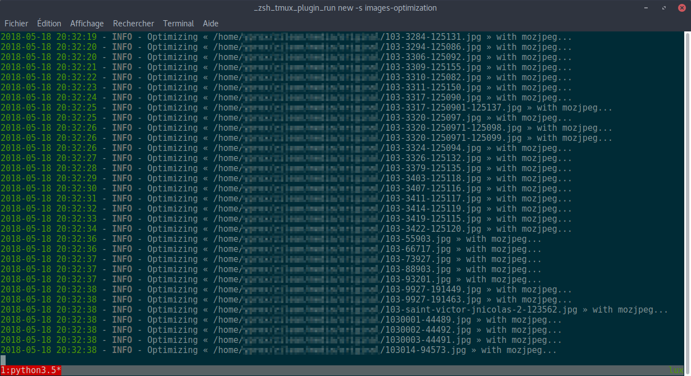

# Images Optimization

> Script Python dogmatique servant à réduire de manière massive le poids des images.



Les images JPEG sont traitées avec [mozjpeg](https://github.com/mozilla/mozjpeg), les images PNG et GIF sont traitées avec [pillow](https://github.com/python-pillow/Pillow).

Les images traitées voient leur propriétaire et groupe modifié pour `www-data`, et leur permission modifiée à `644`.

## Pré-requis

- Python 3.5+
- [mozjpeg](https://github.com/mozilla/mozjpeg) (`cjpeg`)

## Installation

```bash
git clone https://github.com/Yproximite/images-optimization.git
cd images-optimization
pip3 install -r requirements.txt
```

## Configuration

Le fichier de configuration `config.json` permet de configurer le chemin vers l'exécutable `cjpeg`.

## Usage

```bash
./optimize [-h|--help] [--after AFTER] directory
```

### Arguments

#### `directory`

Dossier cible contenant les images à optimiser. 
Peut être un chemin relatif (au projet) ou absolu.

#### `--after AFTER`

`AFTER` doit être un nom de fichier valide contenu dans le dossier `directory`.

En spécifiant cet argument, toutes les images précédant le fichier `AFTER` (les images sont triées par ordre alphabétique) seront ignorées.

#### `-h` et `--help`

Affiche l'aide.
